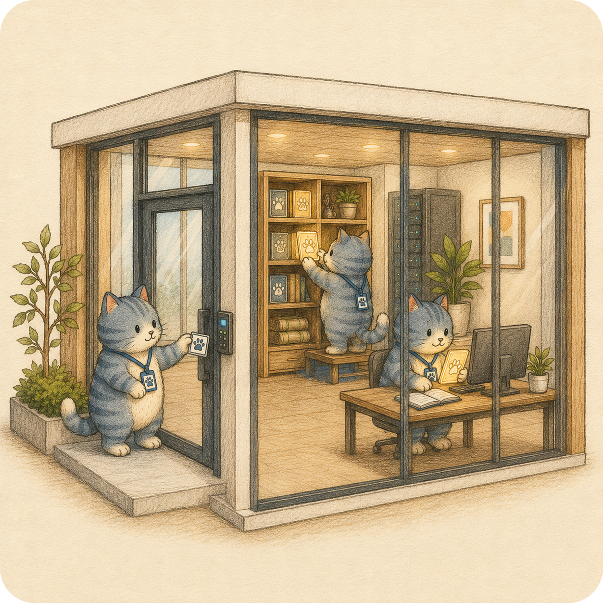
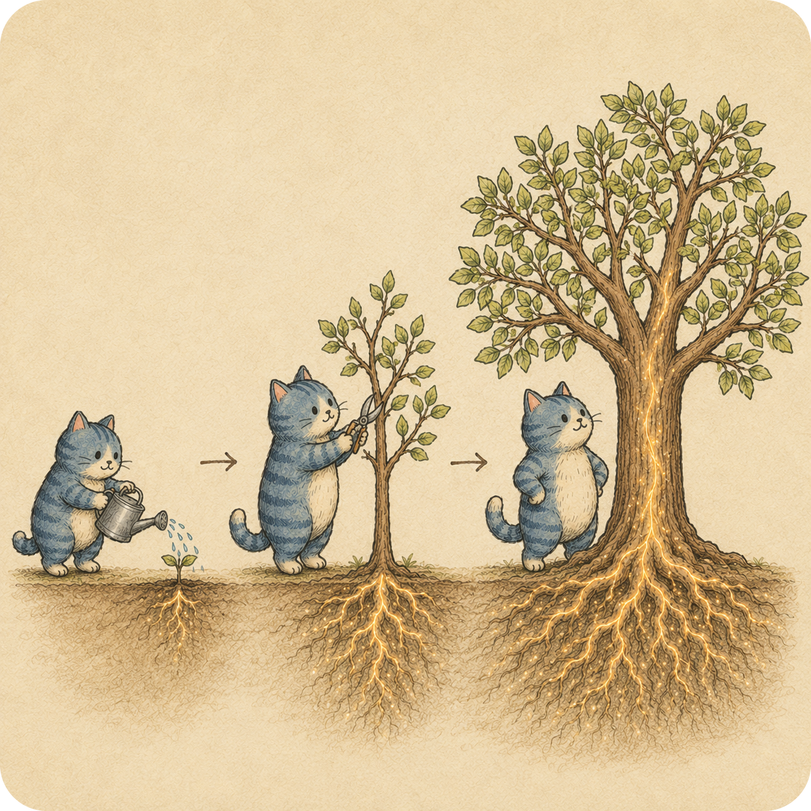
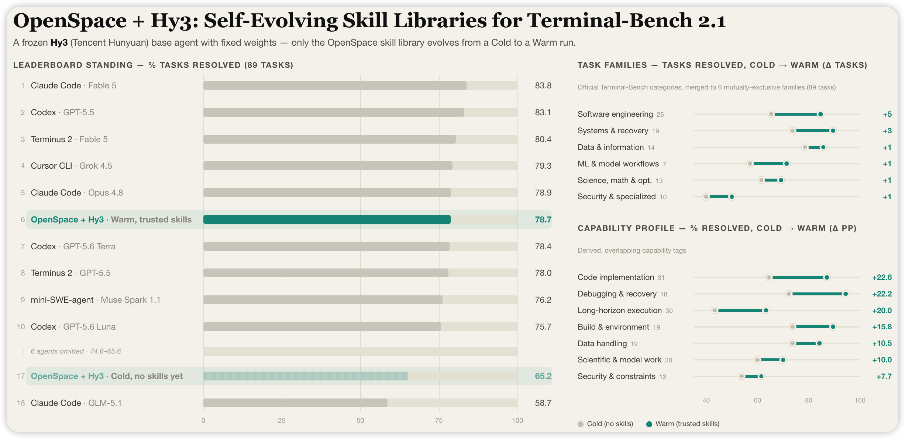

<div align="center">

<picture>
    
</picture>

## OpenSpace: The Quality-First Skill Hub for AI Agents

| 📊 **Real-Task Validated** | 🌐 **Hierarchical Skill Hub** | 🧬 **Evidence-Driven Evolution** | 🛠️ **End2End Quality Records** |

[](https://modelcontextprotocol.io/)
[](https://www.python.org/)
[](https://opensource.org/licenses/MIT/)
[](./COMMUNICATION.md)
[](./COMMUNICATION.md)
[](./README_zh.md)
[](https://github.com/HKUDS/OpenSpace/blob/v1/README.md)

**Your Universal Skill Hub for All AI Agents** — Claude Code, Codex, OpenClaw, Hermès, nanobot.


</div>

---

## Why OpenSpace?
Your agent can already run tasks. But can it remember which skills worked? Can it stop repeating the same mistakes? Can your team share what it learned?

<table>
  <tr>
    <td width="33.33%" align="center"></td>
    <td width="33.33%" align="center"></td>
    <td width="33.33%" align="center"></td>
  </tr>
  <tr>
    <td width="33.33%" valign="top">
      <p align="center"><strong>🌐 One Skill Hub for every agent</strong></p>
      <p>Whether you run OpenClaw, nanobot, Claude Code, Codex, or Cursor, OpenSpace gives all of them a shared place to browse, import, and reuse skills. Stop rebuilding the same experience from scratch in every tool.</p>
    </td>
    <td width="33.33%" valign="top">
      <p align="center"><strong>🔒 A private skill platform your org actually owns</strong></p>
      <p>Deploy OpenSpace inside your own infrastructure. Your workflows stay internal, your data never leaves, and every skill your agents learn becomes a compounding asset — not a black box on someone else's server.</p>
    </td>
    <td width="33.33%" valign="top">
      <p align="center"><strong>📈 Agents that get better with every run</strong></p>
      <p>OpenSpace tracks real task outcomes to evolve skills that work, retire ones that do not, and distill experience into leaner, sharper prompts — so your agent improves over time and spends fewer tokens getting there.</p>
    </td>
  </tr>
</table>

---

## 📢 News

- **2026-07-17** 🚀 **OpenSpace v2 is released**: v2 turns OpenSpace into a quality-first Skill Hub with package-based skill browsing, skill quality summaries, task-trace uploads, and a refreshed dashboard / TUI experience.

<details>
<summary>Earlier news</summary>

- **2026-07-04** 📊 **Skill quality summaries now visible while browsing v2 skills**: package and skill detail views show usage-quality summaries; public lineage pages display redacted placeholders for unavailable content.

- **2026-07-03** 🔎 **Package skill search and task-trace uploads are now first-class v2 flows**: package pages search skills directly, and task traces can be validated, stored, and uploaded idempotently as quality evidence.

- **2026-06-25** 🌐 **The v2 cloud path became more stable for public browsing and private skill access**: public pages, private skill endpoints, frontend / backend routes, and TLS access are now checked together.

- **2026-06-19** 🌐 **Public v2 pages can be read without login**: anonymous visitors can browse public skills, existing users gained an agent bootstrap path, and search / recall services were restored.

- **2026-06-18** 🧭 **The v2 cloud experience became more complete**: package, group, profile, and agent pages were assembled into a cleaner package-browser flow with a more structured import path.

- **2026-06-03** 🪟 **Windows communication gateway startup became more reliable**: process liveness checks received a follow-up fix for users running message adapters on Windows.

- **2026-06-02** 🚀 **Release v2 introduced the new local experience**: the branch added the v2 README, dashboard, TUI, runtime services, sandboxing, memory, scheduler, skill evidence, evolution, triggers, and related assets.

- **2026-05-27** 🪟 **Communication gateway Windows compatibility improved**: gateway runtime PID checks switched to Windows API handling on Windows while keeping the Unix fallback, fixing gateway startup failures on Windows.

- **2026-05-14** 🧭 **Skill libraries, group detail, and lineage history expanded**: users gained owned-skill library pages, shared-skill views inside groups, and retained lineage history for inactive relationships.

- **2026-05-13** 📈 **Package and skill detail pages became safer to inspect**: private data stays hidden when access is unavailable, and task-step records make skill/package views more useful for quality analysis.

- **2026-05-13** ⏱️ **Long shell work became more reliable**: timeouts now clean up subprocess trees, post-task analysis is bounded, and skill-search cache writes are safer.

- **2026-05-10** 📦 **V1 skills can map into v2 identity records**: package skill search respects lineage visibility, and individual skill bundles can be pulled directly.

- **2026-05-09** 👥 **V2 group sharing shipped**: group-scoped skill sharing became available while v1 and v2 sharing paths stay separated.

- **2026-05-01** 🏗️ **Legacy skill collections became easier to move into the v2 hierarchy**: package migration and synthesis tooling added deterministic sampling, safer agent loops, and resume checks.

- **2026-04-29** 📡 **Search and package pull started producing quality records**: v2 added telemetry-backed search, package pull, skill-use sessions, and evolution telemetry for later quality summaries.

- **2026-04-22** 🛡️ **Upload, share, and promote flows became safer to retry**: duplicate and replay handling was hardened so repeated requests behave predictably.

- **2026-04-20** 🔎 **V2 search gained lexical recall and semantic reranking**: package and skill discovery improved beyond exact text matching.

- **2026-04-18** 🛡️ **Sharing and promote-to-public became more predictable**: group / public visibility changes gained idempotent behavior and safer access checks.

- **2026-04-18** ⚡ **Local skill search became much faster after warm-up**: `search_skills` now reuses the SkillRanker embedding cache and refreshes embeddings when skill text changes.

- **2026-04-17** 🔄 **Shared package indexes became more reliable after uploads and sharing changes**: background rebuild and recovery paths now keep package search data in sync.

- **2026-04-16** 🧬 **Evolution candidate status became trackable**: OpenSpace can record candidate processing state, and macOS window / screenshot features no longer get disabled just because `atomacos` is unavailable.

- **2026-04-10** 🧩 **CAPTURED skill placement was corrected**: CAPTURED skills now write back to the correct host-agent skill directory.

- **2026-04-09** 💬 **WhatsApp and Feishu adapters shipped**: OpenSpace added session management, attachment caching, allowlists, and private-safe cloud upload compatibility for external message workflows.

- **2026-04-07** 🌐 OpenSpace MCP now supports standalone **SSE** and **streamable HTTP** startup, making it easier for remote hosts to connect over HTTP instead of stdio and bypass stdio-bound MCP server timeout bottlenecks. See the [host integration guide](openspace/host_skills/README.md) for setup details.
- **2026-04-06** 🛠️ Fixed multiple runtime issues across grounding, MCP serving, skill evolution, and persistence, improving execution stability and recovery in long-running workflows.
- **2026-04-05** 🧭 Cleaned up LLM credential resolution: centralized `.env` loading, improved host config auto-detection, and made provider-native env handling more consistent.
- **2026-04-03** 🚀 Released **v0.1.0** — Skill quality monitoring: structural patterns extracted from high-quality skills now evaluate every new submission daily. Faster, more relevant cloud search. Production-grade vertical skill clusters emerging organically from the community. Frontend now supports Chinese (zh) i18n.
- **2026-04-02** ⚡ Cloud search upgraded for higher relevance and lower latency.
- **2026-03-31** 🛡️ Security hardening: hardened zip extraction and `import_skill` against path traversal. CLI now respects `OPENSPACE_MODEL` and `OPENSPACE_LLM_*` env vars; MiniMax compatibility; workflow ID collision fixes.
- **2026-03-29** 🔒 Pinned litellm to <1.82.7 to avoid PYSEC-2026-2 supply-chain attack.
- **2026-03-28** 🔧 Idempotent skill registration — `register_skill_dir` now returns existing `SkillMeta` for already-registered skills. Updated OpenClaw setup docs.
- **2026-03-27** 🪟 Fixed stdio deadlock on Windows; improved evolver confirmation parsing with stem-style keyword matching.
- **2026-03-26** 🌱 Dynamic skill directory re-scanning on each call, lightweight local skill search, and streamlined documentation.
- **2026-03-25** 🎉 OpenSpace is now open source!

</details>

---

## The Problem with Today's AI Agents

Today's AI agents — OpenClaw, nanobot, Claude Code, Codex, Cursor, and more — are remarkably capable. But beneath the surface, they share a critical blind spot: none of them know which skills actually hold up in the real world.

Think of it like a recipe book that keeps growing — but nobody has ever cooked from it, so no one knows which recipes actually taste good.

- **❌ Skills accumulate without quality signals** — The more you use an agent, the more skills pile up. But there is no way to tell a skill that reliably delivers from one that quietly fails. They all sit in the same folder, looking equally trustworthy.

- **❌ Agents keep repeating the same mistakes** — Once a skill gets picked, the agent keeps reaching for it — even after it starts failing. Without a feedback loop, the agent has no way to learn from bad outcomes. It just tries again.

- **❌ Updating skills is a guessing game** — Change too much and you break things that were working. Change too little and the agent falls behind. There is no principled way to know what to improve, when, or why.

- **❌ Sharing a skill means asking for blind trust** — A skill shared online may look polished. But where did it come from? Has it changed? Has anyone actually finished a real task with it? Today, there is no easy way to know.

## 🎯 What is OpenSpace?

**🚀 OpenSpace is a quality-first Skill Hub where real tasks teach agents which skills to trust, reuse, improve, and share.**

https://github.com/user-attachments/assets/1c6b1b44-b207-491b-ad23-0f0591c17e0a

OpenSpace plugs into your agent as skills.

- **v1** helped agents learn, evolve, and share experience.

- **v2** adds the missing quality layer: every skill is judged by real task results, improved through controlled evolution, and shared with clear context — not just uploaded and forgotten.

<div align="center">

<br />
<sub>Skill Wiki turns shared skills into a searchable package tree with lineage and quality context.</sub>
</div>

OpenSpace v2 gives agents four practical abilities:

### 📊 Skill Quality from Real Tasks

Stop guessing. Know which skills actually work.

- **✅ Task-result quality** — Every skill run is tracked: was it selected, applied, completed, or did it fall back? Over time, the pattern tells the truth.
- **✅ Tool reliability** — When a tool fails, slows down, or becomes risky, every skill that depends on it gets flagged — automatically.
- **✅ Quality-aware reuse** — A skill that consistently finishes real work is treated differently from one that keeps falling short. Your agent stops guessing.
- **✅ Clear evidence** — Instead of trusting a skill's description, users can inspect what actually happened across real runs.

**A skill earns its place by working in the real world — not by looking good in a file.**

### 🧬 Controlled Skill Evolution

Agents need to improve. But improvement without control is just chaos.
- ✅ **Evidence-driven updates** — Real task evidence decides when a skill should be fixed, derived, or captured.
- ✅ **Provisional first** — New evolved skills remain reusable but provisional until real cross-task success promotes them to trusted.
- ✅ **Independent trust** — Trust and availability are separate; a skill can be provisional or trusted while operators independently enable or disable it.
- ✅ **Validated skills** — A skill is checked before a new version replaces the old one.
- ✅ **Version history** — Users can see how a skill changed over time.

**Agents should adapt to the real world, but every change needs control.**

### 🌐 Local-First Skill Hub

Your skills run locally. Your data never has to leave.

- ✅ **Local-first workflow** — Your agent can run, search, and evolve skills locally.
- ✅ **Package organization** — Cloud skills are grouped by package so people can browse and review them.
- ✅ **Explicit import** — Cloud skills are imported into a local skill folder before reuse.
- ✅ **Reviewable sharing** — Shared skills carry context such as package, visibility, history, and quality signals.

**The cloud is for skill discovery. Your machine is for agent execution. The line never blurs.**

### 🛠️ Agent Harness with Quality Records
Run the agent in a way that leaves useful evidence.
- ✅ **Recoverable sessions** — Long tasks can keep their task history, tool results, and files.
- ✅ **Permission-aware tools** — Tool calls pass through validation, permissions, and sandboxing.
- ✅ **Quality records** — Executions produce the evidence used for quality judgment and evolution.
- ✅ **One runtime boundary** — CLI, Python API, MCP, gateway, and dashboard share the same execution model.

**OpenSpace does not just run your tasks — it turns every run into evidence, and every piece of evidence into a skill worth trusting.**

---

### The Difference

**❌ Current Agents**
- Skills pile up with no signal for which ones still hold up.
- Failures repeat because nothing marks a bad experience as one to avoid.
- Self-improvement is either absent or uncontrolled — noise either way.
- Shared skills ask for blind trust, with no quality tied to real results.

**✅ OpenSpace v1**
- Gives agents a persistent skill memory that carries across tasks and sessions.
- Learns from successful workflows and failed executions — not just the happy path.
- Evolves skills through structured FIX, DERIVED, and CAPTURED updates.
- Shares hard-won experience so one agent's lessons can benefit another.

**✅ OpenSpace v2**
- Keeps the v1 learning loop, and makes quality the signal that drives everything.
- Judges every skill by what actually happened: selected, applied, completed, or fell back.
- Evolves skills only when evidence demands it — with validation, version history, and full control.
- Organizes cloud skills by package for meaningful browsing, then imports them locally before any reuse.
- Runs agents in a harness that captures the evidence quality judgment and skill evolution both depend on.

### 📊 Terminal-Bench 2.1: Self-Evolution That Shows Up in the Score

With the same frozen Hy3 backbone, OpenSpace improves from a 65.2% Cold run to a 78.7% Warm run as its trusted skill library evolves.

<div align="center">
  
</div>

## 📋 Table of Contents

- [⚡ Quick Start](#-quick-start)
  - [🤖 Path A: For Your Agent](#-path-a-for-your-agent)
  - [👤 Path B: Command Line](#-path-b-command-line)
  - [📊 Local Dashboard](#-local-dashboard)
- [🏗️ Framework](#framework)
  - [📊 Skill Quality Layer](#-skill-quality-layer)
  - [🧬 Controlled Skill Evolution](#-controlled-skill-evolution)
  - [🌐 Local-First Skill Hub](#-local-first-skill-hub)
  - [🛠️ Agent Harness with Quality Records](#️-agent-harness-with-quality-records)
<!-- - [🔧 Advanced Configuration](#-advanced-configuration) -->
- [📖 Code Structure](#-code-structure)
- [🔗 Related Projects](#-related-projects)

---

## ⚡ Quick Start

🌐 **Just want to explore?** Browse community skills, evolution lineage at **[open-space.cloud](https://open-space.cloud)** — no installation needed.

```bash
git clone https://github.com/HKUDS/OpenSpace.git && cd OpenSpace
pip install -e .
openspace-mcp --help   # verify installation
```

> [!TIP]
> **Slow clone?** The `assets/` folder (~50 MB of images) makes the default clone large. Use this lightweight alternative to skip it:
> ```bash
> git clone --filter=blob:none --sparse https://github.com/HKUDS/OpenSpace.git
> cd OpenSpace
> git sparse-checkout set --no-cone '/*' '!/assets/'
> pip install -e .
> ```

**Choose your path:**
- **[Path A](#-path-a-for-your-agent)** — Plug OpenSpace into your agent
- **[Path B](#-path-b-command-line)** — Use OpenSpace directly from the command line

### 🤖 Path A: For Your Agent

Works with any host that can launch an MCP server and read skills (`SKILL.md`). OpenSpace ships host helpers for OpenClaw and nanobot, and can be wired manually from Claude Code, Codex, Cursor, or other MCP-capable agents.

**For your agent**

Open your coding agent and paste:

```text
Install OpenSpace for this host agent.

If an OpenSpace repo is already open, use its current repository root as
OPENSPACE_WORKSPACE. Otherwise, clone it first:
`git clone https://github.com/HKUDS/OpenSpace.git && cd OpenSpace`

First read:
- README.md -> Quick Start -> Path A: For Your Agent
- openspace/host_skills/README.md -> exact setup for this host
- openspace/.env.example only if model or cloud credentials are needed

Then:
1. Verify a Python 3.12+ interpreter is available. If `openspace-mcp --help`
   is unavailable, install OpenSpace from this repo with that interpreter:
   `python -m pip install -e .`
2. Detect this host agent's MCP config file/format and local skill directory.
   Preserve existing config and unrelated MCP servers.
3. Configure an MCP server named `openspace`. Prefer stdio for local use:
   `command: openspace-mcp`. Use streamable HTTP only if this host cannot use
   stdio or needs a standalone/remote server.
4. Set `OPENSPACE_WORKSPACE` to the absolute repo root and
   `OPENSPACE_HOST_SKILL_DIRS` to the host agent's skill directory.
5. Copy `openspace/host_skills/delegate-task` and
   `openspace/host_skills/skill-discovery` into the host agent's skill directory.
6. If cloud access is required, use `openspace-cloud-auth bootstrap-agent-key`.
   Do not ask me to paste secrets into chat; stop if a required credential or
   email is missing.
7. Reload or restart the host agent if its MCP/skill system requires it.

Do not report success until `openspace-mcp --help` works, the MCP client can see
OpenSpace tools, a lightweight local skill search works, and long `execute_task`
calls have a timeout of at least 600 seconds. In your final report, include the
MCP config path, skill directory, chosen transport, and verification results. If
any path, config format, Python version, credential, MCP transport, or skill
directory is missing, stop and tell me exactly what is missing.
```

**Setup steps (manual or agent-assisted)**

**① Add OpenSpace to your host agent's MCP config:**

```json
{
  "mcpServers": {
    "openspace": {
      "command": "openspace-mcp",
      "toolTimeout": 600,
      "env": {
        "OPENSPACE_HOST_SKILL_DIRS": "/path/to/your/agent/skills",
        "OPENSPACE_WORKSPACE": "/path/to/OpenSpace",
        "OPENSPACE_CLOUD_MODE": "live",
        "OPENSPACE_CLOUD_API_KEY": "sk-xxx (optional, for cloud)"
      }
    }
  }
}
```

> [!TIP]
> Credentials (API key, model) are auto-detected from nanobot and OpenClaw configs. Other hosts should set `OPENSPACE_LLM_API_KEY` / `OPENSPACE_MODEL`, or rely on `openspace/.env`.

> [!NOTE]
> OpenSpace supports 3 launch modes:
> - **stdio**: keep `command: "openspace-mcp"` in the host config.
> - **SSE**: start `openspace-mcp --transport sse --host 127.0.0.1 --port 8080`.
> - **streamable HTTP**: start `openspace-mcp --transport streamable-http --host 127.0.0.1 --port 8081`.
>
> Common remote endpoints:
> - SSE endpoint: `http://127.0.0.1:8080/sse`
> - streamable HTTP endpoint: `http://127.0.0.1:8081/mcp`
>
> `stdio` is the simplest option. HTTP modes keep OpenSpace as a standalone server, but **host-specific registration syntax** and **host-side timeouts** still apply.

**② Copy skills** into your agent's skills directory:

```bash
cp -r OpenSpace/openspace/host_skills/delegate-task/ /path/to/your/agent/skills/
cp -r OpenSpace/openspace/host_skills/skill-discovery/ /path/to/your/agent/skills/
```

Done. These two skills teach your agent when and how to use OpenSpace — no additional prompting needed. Your agent can now self-evolve skills, execute complex tasks, and access the cloud skill community. You can also add your own custom skills; see [Skills](#skills).

> [!NOTE]
> **Cloud community (optional):** Run `openspace-cloud-auth bootstrap-agent-key --email you@example.com --agent-name openspace-local-agent` to provision an owner-scoped cloud agent key. The command stores `OPENSPACE_CLOUD_MODE=live` and `OPENSPACE_CLOUD_API_KEY` locally without printing the raw key. Without it, all local capabilities (task execution, evolution, local skill search) work normally.

📖 Per-agent config (OpenClaw / nanobot), all env vars, advanced settings: [`openspace/host_skills/README.md`](openspace/host_skills/README.md)

### 👤 Path B: Command Line

Use OpenSpace directly from the command line — coding, search, tool use, and more — with self-evolving skills and cloud community built in.

> [!NOTE]
> Create a `.env` file with your LLM API key. For cloud community access, provision the agent key with `openspace-cloud-auth bootstrap-agent-key` (refer to [`openspace/.env.example`](openspace/.env.example)).

```bash
# Interactive command-line mode
openspace

# Execute task
openspace --model "anthropic/claude-sonnet-4-5" --query "Create a monitoring dashboard for my Docker containers"
```

### Skills

Add project skills under `.openspace/skills/<skill-name>/`. Each skill is a directory containing a `SKILL.md`; optional helper files can live alongside it:

```text
.openspace/
└── skills/
    ├── my-skill/
    │   └── SKILL.md
    └── another-skill/
        ├── SKILL.md
        └── helper.sh
```

<details>
<summary>Discovery, IDs, and safety</summary>

OpenSpace discovers skills from `OPENSPACE_HOST_SKILL_DIRS`, configured `skills.skill_dirs`, project roots such as `.openspace/skills`, user roots such as `~/.openspace/skills`, and finally bundled OpenSpace skills in `openspace/skills`.

Each discovered skill has a `.skill_id` sidecar for stable tracking. New project or user skills can omit it; OpenSpace creates one on first discovery. Keep `.skill_id` when you want a copied skill to remain the same logical skill, and remove it before first discovery when you are creating an independent skill. Cloud upload requires the matching local SkillStore record to be `trusted`; both public and private uploads fail closed for provisional or unknown records. The local trust state is not sent to the cloud, and `.skill_id` is skipped as a regular uploaded file.

All discovered skills pass `check_skill_safety` before loading. Skills with dangerous patterns, such as prompt injection or credential exfiltration, are blocked and logged.

</details>

**Cloud CLI** — manage skills from the command line:

```bash
openspace-download-skill <skill_id>         # download a skill from the cloud
openspace-upload-skill --skill-dir /path/to/skill/dir  # upload a trusted skill
```

### 📊 Local Dashboard

See how your skills evolve — browse skills, track lineage, compare diffs.

> Requires **Node.js ≥ 20**.

```bash
# Terminal 1. Start backend API
openspace-dashboard --port 7788

# Terminal 2: Start frontend dev server
cd apps/dashboard
npm install        # only needed once
npm run dev    
```

📖 **Frontend setup guide**: [`apps/dashboard/README.md`](apps/dashboard/README.md)

<div align="center">
<table>
<tr>
<td width="50%"></td>
<td width="50%"></td>
</tr>
<tr>
<td align="center"><sub>Skill Classes — Browse, Search & Sort</sub></td>
<td align="center"><sub>Cloud — Browse & Discover Skill Records</sub></td>
</tr>
<tr>
<td width="50%"></td>
<td width="50%"></td>
</tr>
<tr>
<td align="center"><sub>Version Lineage — Skill Evolution Graph</sub></td>
<td align="center"><sub>Workflow Sessions — Execution History & Metrics</sub></td>
</tr>
</table>
</div>

---

### Python API

Use the Python API when you want to embed OpenSpace inside your own runtime instead of launching it through MCP or the CLI.

```python
import asyncio
from openspace import OpenSpace
from openspace.runtime import ExecutionRequest

async def main():
    async with OpenSpace() as cs:
        result = await cs.execute(
            ExecutionRequest(
                prompt="Analyze GitHub trending repos and create a report",
            )
        )
        print(result.text)

        for skill in result.evolved_skills:
            print(f"  Evolved: {skill['name']} ({skill['origin']})")

asyncio.run(main())
```

---

## Framework

OpenSpace v2 has four connected layers. They match the problems above: judge skill quality, improve skills with control, share skills with context, and run agents with quality records.

### 📊 Skill Quality Layer

The quality layer answers the first question: **which skills can the agent trust?**

- **Skill outcomes** — Records whether a skill was selected, applied, completed the task, or fell back.
- **Tool reliability** — Tracks tool failures and slowdowns that can make a skill unreliable.
- **Task-result as evidence** — Uses real task behavior instead of skill descriptions alone.

**Result:** the skill folder becomes easier to trust because OpenSpace knows what worked in real runs.

### 🧬 Controlled Skill Evolution

The evolution layer answers the second question: **when should a skill change?**

- **FIX** — Repair a broken or outdated skill.
- **DERIVED** — Create a better or more specialized version from an existing skill.
- **CAPTURED** — Save one reusable subworkflow only when the source trace shows
  both its execution and a separate validation of the claimed postcondition.
  Whole-task success is neither required nor sufficient.
- **Independent capture review** — Before commit, one bounded semantic review
  verifies that cited observations support the exact capability and that the
  authored skill contains no broader or explicitly unverified procedure.
- **Provisional → trusted** — A validated evolved skill can be reused immediately as provisional; independent successful use promotes it to trusted, while an attributable failure demotes it.
- **Separate availability** — `enabled` controls reuse independently from the two-state trust lifecycle.
- **Audit-only candidates** — Blocked or uncertain proposals remain inspectable candidates; recurrence never auto-rechecks or promotes them into skills.

**Result:** agents can adapt to real-world change without turning every signal into noisy self-modification.

### 🌐 Local-First Skill Hub

The hub layer answers the third question: **how should skills be shared and reviewed?**

- **Local skill folders** — Agents run and reuse skills locally.
- **Package organization** — Cloud skills are grouped by package so people can browse them with context.
- **Explicit import** — A cloud skill enters a local folder before the agent reuses it.
- **Reviewable history** — Shared skills can show package, visibility, lineage, and quality signals.

**Result:** skills are shared as reviewable knowledge, not as a flat pile of files.

### 🛠️ Agent Harness with Quality Records

The harness layer answers the fourth question: **where does the quality evidence come from?**

- **Recoverable sessions** — Saves task history, tool results, and file changes for long-running work.
- **Permission-aware tools** — Validates tool calls and runs them with permission and sandbox checks.
- **Quality records** — Turns execution results into evidence for skill quality and evolution.
- **Shared runtime** — CLI, Python API, MCP, gateway, and dashboard use the same execution layer.

**Result:** OpenSpace can judge and evolve skills because agent work leaves clear, reusable records.

---

<!--
## 🔧 Advanced Configuration

For most users, [Quick Start](#-quick-start) is all you need. For advanced options (persistent `settings.json`, environment variables, execution modes, security policies, etc.), see [`openspace/config/README.md`](openspace/config/README.md).

### Skill Evolution Runtime

OpenSpace enables the evolution engine by default in `autonomous` mode:

```env
OPENSPACE_EVOLUTION_ENGINE_ENABLED=1
OPENSPACE_EVOLUTION_MODE=autonomous
```

Modes:

- `audit_only`: record jobs, packets, decisions, and admissions only; no skill writes.
- `fix_only`: explicit/manual FIX jobs such as MCP `fix_skill` can commit after evidence, admission, staged authoring, validation, and commit. DERIVED and CAPTURED actions are recorded as policy-blocked candidates/proposals instead of being committed or auto-rechecked.
- `autonomous`: default; all admission-approved and validated FIX/DERIVED/CAPTURED actions may commit.

Set `OPENSPACE_EVOLUTION_ENGINE_ENABLED=0` only when you want to pause all evolution job processing.

---
-->

<a id="-code-structure"></a>
<details>
<summary><b>📖 Code Structure</b></summary>

> **Legend**: ⚡ Core modules &nbsp;|&nbsp; 🧬 Skill evolution &nbsp;|&nbsp; 🌐 Cloud &nbsp;|&nbsp; 🔧 Supporting modules

```
OpenSpace/
├── openspace/
│   ├── runtime/                          # Runtime-owned services, state, session/workspace orchestration, execution lifecycle
│   ├── application.py                    # Public OpenSpace/OpenSpaceConfig facade; delegates lifecycle to runtime
│   ├── entrypoints/                      # CLI, TUI, MCP, gateway, and dashboard process entrypoints
│   │
│   ├── ⚡ agents/                         # Agent System
│   │   ├── base.py                       # Base agent class
│   │   └── grounding_agent.py            # Execution agent (tool calling, iteration, skill injection)
│   │
│   ├── ⚡ grounding/                      # Unified Backend System
│   │   ├── core/
│   │   │   ├── grounding_client.py       # Unified interface across all backends
│   │   │   ├── search_tools.py           # Smart Tool RAG (BM25 + embedding + LLM)
│   │   │   ├── quality/                  # Tool quality tracking & self-evolution
│   │   │   ├── security/                 # Policies, sandboxing, E2B
│   │   │   ├── meta/                     # Meta provider & tools
│   │   │   ├── transport/                # Connectors & task managers
│   │   │   └── tool/                     # Tool abstraction (base, local, remote)
│   │   └── backends/
│   │       ├── shell/                    # Shell command execution
│   │       ├── gui/                      # Anthropic Computer Use
│   │       ├── mcp/                      # Model Context Protocol (stdio, HTTP, WebSocket)
│   │       └── web/                      # Web search & browsing
│   │
│   ├── 🧬 skill_engine/                  # Self-Evolving Skill System
│   │   ├── registry.py                   # Skill catalog, frontmatter parsing, content loading
│   │   ├── protocol.py                   # Skill/DiscoverSkills tools and listing attachments
│   │   ├── analyzer.py                   # Post-execution analysis (agent loop + tool access)
│   │   ├── evolver.py                    # FIX / DERIVED / CAPTURED evolution (3 triggers)
│   │   ├── patch.py                      # Multi-file FULL / DIFF / PATCH application
│   │   ├── store.py                      # SQLite persistence, version DAG, quality metrics
│   │   ├── skill_ranker.py               # BM25 + embedding hybrid ranking
│   │   ├── fuzzy_match.py                # Fuzzy matching for skill discovery
│   │   ├── conversation_formatter.py     # Format execution history for analysis
│   │   ├── skill_utils.py                # Shared skill utilities
│   │   └── types.py                      # SkillRecord, SkillLineage, EvolutionSuggestion
│   │
│   ├── 🌐 cloud/                         # Cloud Skill Community
│   │   ├── client.py                     # HTTP client (upload, download, search)
│   │   ├── account.py                    # User registration and agent-key lifecycle client
│   │   ├── auth_flow.py                  # High-level account bootstrap and verification flow
│   │   ├── search.py                     # Hybrid search engine
│   │   ├── embedding.py                  # Embedding generation for skill search
│   │   └── cli/                          # CLI tools (auth, download_skill, upload_skill)
│   │
│   ├── 💬 communication/                  # Multi-channel gateway runtime support
│   │   ├── gateway_runtime.py            # Gateway locks and runtime status
│   │   ├── runtime_manager.py            # Per-channel OpenSpace runtime lifecycle
│   │   ├── adapters/                     # Platform adapters (WhatsApp, Feishu)
│   │   ├── bridges/                      # Non-Python runtimes (WhatsApp Baileys bridge)
│   │   ├── config.py                     # Communication config loader
│   │   ├── session_store.py              # Per-channel session persistence
│   │   └── types.py                      # ChannelMessage, ChannelSource, SendResult
│   │
│   ├── 🚪 entrypoints/                    # Public CLI/server entrypoints
│   │   ├── cli/main.py                   # `openspace`
│   │   ├── dashboard/server.py           # `openspace-dashboard`
│   │   ├── gateway/server.py             # `openspace-gateway`
│   │   ├── mcp/server.py                 # `openspace-mcp`
│   │   └── tui/controller.py             # TypeScript TUI bridge controller
│   │
│   ├── 🔧 platforms/                     # Platform abstraction (system info, screenshots)
│   ├── 🔧 host_detection/                # Auto-detect nanobot / openclaw credentials
│   ├── 🔧 host_skills/                   # SKILL.md definitions for agent integration
│   │   ├── delegate-task/SKILL.md        # Teaches agent: execute, fix, upload
│   │   └── skill-discovery/SKILL.md      # Teaches agent: search & discover skills
│   ├── 🔧 prompts/                       # LLM prompt templates (grounding + skill engine)
│   ├── 🔧 llm/                           # LiteLLM wrapper with retry & rate limiting
│   ├── 🔧 config/                        # Layered configuration system
│   ├── 🔧 local_server/                  # GUI backend Flask server; shell backend is local-only
│   ├── 🔧 recording/                     # Execution recording, screenshots & video capture
│   ├── 🔧 utils/                         # Logging, UI, telemetry
│   └── 📦 skills/                        # Built-in skills (lowest priority, user can add here)
│
├── apps/
│   ├── dashboard/                        # Dashboard UI (React + Tailwind)
│   └── tui/                              # TypeScript terminal UI
├── benchmarks/
│   └── gdpval/                           # Legacy v1 benchmark materials
├── examples/
│   └── my-daily-monitor/                 # Legacy v1 generated example and assets
├── .openspace/                           # Runtime: embedding cache + skill DB
└── logs/                                 # Execution logs & recordings
```

</details>

## 🔗 Related Projects

OpenSpace builds upon the following open-source projects. We sincerely thank their authors and contributors:

- **[AnyTool](https://github.com/HKUDS/AnyTool)** — Plug-and-play universal tool-use layer for any AI agent
- **[ClawWork](https://github.com/HKUDS/ClawWork)** - Transforms AI assistants into true AI coworkers
- **[WorldMonitor](https://github.com/koala73/worldmonitor)** - Real-time global intelligence dashboard

---

<div align="center">

## ⭐ Star History

If you find OpenSpace helpful, please consider giving us a star! ⭐

<div align="center">
  <a href="https://star-history.com/#HKUDS/OpenSpace&Date">
    <picture>
      <source media="(prefers-color-scheme: dark)" srcset="https://api.star-history.com/svg?repos=HKUDS/OpenSpace&type=Date&theme=dark" />
      <source media="(prefers-color-scheme: light)" srcset="https://api.star-history.com/svg?repos=HKUDS/OpenSpace&type=Date" />
      
    </picture>
  </a>
</div>

**📊 Help Your Agent Find Reliable Skills · 🧬 Evolve Under Control in Real Tasks · 🌐 A Hierarchical, Reviewable Skill Hub**

</div>

---

<p align="center">
  <em> ❤️ Thanks for visiting ✨ OpenSpace!</em><br><br>
  
</p>
