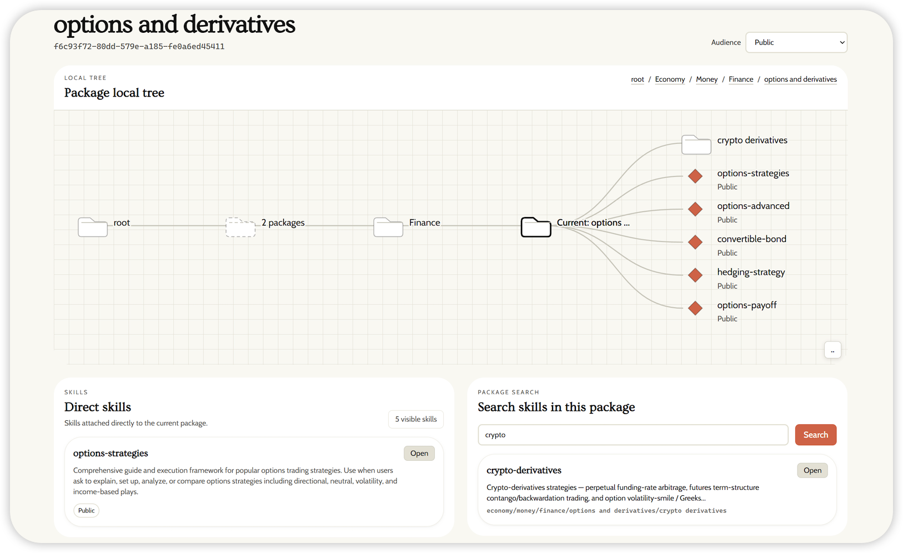

<div align="center">

<picture>
    
</picture>

## OpenSpace：面向 Agent 的 Skill Hub - 质量优先，而非数量堆积

| 📊 **真实任务验证 Skill有效性** | 🧬 **证据驱动的可控进化** | 🌐 **层级化 Skill Hub** | 🛠️ **全程质量记录** |

[](https://modelcontextprotocol.io/)
[](https://www.python.org/)
[](https://opensource.org/licenses/MIT/)
[](./COMMUNICATION.md)
[](./COMMUNICATION.md)
[](./README.md)
[](https://github.com/HKUDS/OpenSpace/blob/v1/README_CN.md)

**一条命令，进化你所有的 AI Agent**：OpenClaw、nanobot、Claude Code、Codex、Cursor 等。


</div>

---

## 📢 最新动态

- **2026-07-17** 🚀 **OpenSpace v2 正式发布**：v2 将 OpenSpace 升级为质量优先的 Skill Hub，带来基于 package 的 Skill 浏览、Skill 质量摘要、task-trace 证据上传，以及更新后的本地 dashboard / TUI 体验。

- **2026-07-04** 📊 **浏览 v2 Skill 时可以看到质量摘要**：package 与 skill detail 视图可以展示 usage-quality summary；public lineage 页面在无法展示私有内容时会使用脱敏占位。

- **2026-07-03** 🔎 **Package 内 Skill 搜索与 task-trace 上传成为 v2 正式流程**：package 页面可以直接搜索 Skill；task trace 可以被校验、存储，并以幂等方式上传为质量证据。

- **2026-06-25** 🌐 **v2 cloud 路径对 public browse 与 private skill access 更稳定**：public 页面、private skill endpoint、前后端路由与 TLS access 被放到同一条验证链路中。

<details>
<summary>更早动态</summary>

- **2026-06-19** 🌐 **v2 public 页面可以免登录读取**：匿名用户可以浏览 public skills，已有用户获得 agent bootstrap 路径，search / recall service 也恢复可用。

- **2026-06-18** 🧭 **v2 cloud 体验更完整**：package、group、profile 与 agent 页面整合到更清晰的 package-browser 流程中，也配套了更结构化的 import 路径。

- **2026-06-03** 🪟 **Windows communication gateway 启动更可靠**：针对 Windows message adapter 的 process liveness check 完成 follow-up 修复。

- **2026-06-02** 🚀 **release v2 引入新的本地使用体验**：分支加入 v2 README、dashboard、TUI、runtime services、sandboxing、memory、scheduler、Skill evidence、evolution、triggers 与相关 assets。

- **2026-05-27** 🪟 **通信网关 Windows 兼容性改进**：gateway runtime 在 Windows 上改用 Windows API 检查 PID，同时保留 Unix fallback，修复 Windows 下 gateway 启动失败问题。

- **2026-05-14** 🧭 **Skill library、group detail 与 lineage history 扩展**：用户可以看到 owned-skill library、group 内 shared-skill 视图，以及 inactive relationship 的历史 lineage。

- **2026-05-13** 📈 **Package 与 Skill detail 页面更适合安全查看**：没有访问权限时私有内容会保持隐藏，task-step record 也让 Skill / package 视图更适合做质量分析。

- **2026-05-13** ⏱️ **长时间 shell 任务更可靠**：timeout 现在会清理 subprocess tree，post-task analysis 被加上边界，Skill search cache 写入也更安全。

- **2026-05-10** 📦 **v1 Skill 可以映射到 v2 identity record**：package 内 Skill 搜索会尊重 lineage visibility，单个 Skill bundle 也可以被直接拉取。

- **2026-05-09** 👥 **v2 group sharing 上线**：Skill 可以按 group scope 分享，同时 v1 与 v2 sharing path 保持隔离。

- **2026-05-01** 🏗️ **旧 Skill collection 更容易迁移到 v2 层级结构**：package migration 与 synthesis tooling 增加 deterministic sampling、更安全的 agent loop 和 resume check。

- **2026-04-29** 📡 **Search 与 package pull 开始产生质量记录**：v2 加入 telemetry-backed search、package pull、skill-use session 与 evolution telemetry，为后续质量摘要提供基础。

- **2026-04-22** 🛡️ **Upload、share、promote 流程更适合重试**：duplicate 与 replay 处理被加固，重复请求的行为更可预测。

- **2026-04-20** 🔎 **v2 Search 加入 lexical recall 与 semantic reranking**：package / skill discovery 不再只依赖精确文本匹配。

- **2026-04-18** 🛡️ **Sharing 与 promote-to-public 更可预测**：group / public visibility change 获得幂等行为和更安全的访问检查。

- **2026-04-18** ⚡ **本地 Skill 搜索 warm-up 后更快**：`search_skills` 复用 SkillRanker embedding cache，并在 Skill 文本变化时刷新 embedding。

- **2026-04-17** 🔄 **上传和分享后的 package search index 更可靠**：后台 rebuild 与 recovery 路径会保持 package search 数据同步。

- **2026-04-16** 🧬 **Evolution candidate 状态可追踪**：OpenSpace 可以记录 candidate processing state；macOS window / screenshot 能力也不会因为缺少 `atomacos` 而被误关。

- **2026-04-10** 🧩 **CAPTURED Skill 写入位置修正**：CAPTURED Skill 现在会写回正确的 host-agent skill directory。

- **2026-04-09** 💬 **WhatsApp 与 Feishu adapter 发布**：OpenSpace 新增 session management、attachment cache、allowlist，以及外部消息流程所需的 private-safe cloud upload compatibility。

- **2026-04-07** 🌐 OpenSpace MCP 新增独立 **SSE** 与 **streamable HTTP** 启动方式，便于远端 host 通过 HTTP 接入，绕过基于 stdio 的 MCP server timeout 瓶颈。具体接入方式见 [host integration 文档](openspace/host_skills/README.md)。
- **2026-04-06** 🛠️ 修复多项运行时问题，覆盖 grounding、MCP 服务、Skill 进化与持久化链路，长流程执行的稳定性与恢复能力进一步提升。
- **2026-04-05** 🧭 LLM 凭证解析清理完成：统一 `.env` 加载逻辑，改进宿主配置自动识别，并让 provider 原生环境变量处理更一致。
- **2026-04-03** 🚀 发布 **v0.1.0** — Skill 质量监控上线：从优质 Skill 中提取结构模式，每日自动评估所有新提交；云端搜索全面升级，匹配更准、响应更快；社区自发形成生产级垂直 Skill 集群。前端新增中文（zh）国际化支持。
- **2026-04-02** ⚡ 云端搜索升级，提升匹配质量、降低响应延迟。
- **2026-03-31** 🛡️ 安全加固：zip 解压与 `import_skill` 新增路径穿越防护；CLI 启动时读取 `OPENSPACE_MODEL` 及 `OPENSPACE_LLM_*` 环境变量；修复 MiniMax 兼容性问题与 workflow ID 冲突。
- **2026-03-29** 🔒 锁定 litellm 版本至 <1.82.7，规避 PYSEC-2026-2 供应链投毒。
- **2026-03-28** 🔧 Skill 注册幂等化——`register_skill_dir` 对已注册目录直接返回已有 `SkillMeta`，不再重复创建。同步更新 OpenClaw 部署文档。
- **2026-03-27** 🪟 修复 Windows 下 stdio 死锁；evolver 确认解析改用词干匹配，消除误判。
- **2026-03-26** 🌱 Skill 目录支持每次调用时动态重扫描，本地搜索更轻量，文档同步精简。
- **2026-03-25** 🎉 OpenSpace 正式开源！

</details>

---

## 当前 AI Agent 面临的问题

今天的 AI Agent——[OpenClaw](https://github.com/openclaw/openclaw)、[nanobot](https://github.com/HKUDS/nanobot)、[Claude Code](https://docs.anthropic.com/en/docs/claude-code)、[Codex](https://github.com/openai/codex)、[Cursor](https://cursor.com) 等——已经很强大，但仍有一个关键弱点：它们不知道哪些 Skill 在真实使用后仍然可靠。

- **❌ Skill 越堆越多，却缺少质量信号** - Skill folder 可以很快变大，但弱 Skill 和强 Skill 经常看起来差不多。
- **❌ Agent 会重复坏经验** - 如果某个 Skill 曾经看起来有用，Agent 可能会一直选择它，即使它失败、fallback，或已经过时。
- **❌ Skill 演化很难控制** - 什么都改会制造噪音，什么都不改又无法适应真实世界。
- **❌ 共享缺少信任** - 下载来的 Skill 可能看起来很完整，但用户很难看出它来自哪里、如何变化、是否真的帮助完成过任务。

## 🎯 什么是 OpenSpace？

**🚀 OpenSpace 是一个质量优先的 Skill Hub：让真实任务教会 Agent 哪些 Skill 值得信任、复用、改进和共享。**

https://github.com/user-attachments/assets/1c6b1b44-b207-491b-ad23-0f0591c17e0a

OpenSpace 以 Skill 的形式接入你的 Agent。v1 帮助 Agent 学习、进化和共享经验；v2 补上了缺失的质量层：每个有用的 Skill 都应该由真实任务结果来判断，通过受控演化来改进，并带着清晰上下文被共享。

<div align="center">

<br />
<sub>Skill Wiki 将共享 Skill 组织成可搜索的 package tree，并保留谱系与质量上下文。</sub>
</div>

OpenSpace v2 给 Agent 四项实际能力：

### 📊 来自真实任务的 Skill 质量判断

知道哪些 Skill 真的有帮助。

- ✅ **任务结果质量** — 跟踪某个 Skill 是否被选中、是否被应用、是否完成任务、是否 fallback。
- ✅ **工具可靠性** — 记录工具何时失败、变慢，或对依赖它的 Skill 变得有风险。
- ✅ **可感知质量的复用** — 质量弱的 Skill 不会和持续帮助真实任务的 Skill 被同等对待。
- ✅ **清晰证据** — 用户可以查看真实运行行为，而不是只相信 Skill 文本。

**一个 Skill 有用，不是因为它写得好看，而是因为它在真实任务中有效。**

### 🧬 受控 Skill 演化

从经验中改进，但不是盲目地什么都改。

- ✅ **证据驱动更新** — 真实任务证据决定一个 Skill 应该被修复、派生，还是捕获为新 Skill。
- ✅ **先 provisional** — 新演化出的 Skill 可以复用，但会保持 provisional，直到真实的跨任务成功将其晋级为 trusted。
- ✅ **信任与可用性分离** — Skill 可以是 provisional 或 trusted，操作者仍可独立启用或禁用它。
- ✅ **验证后的 Skill** — 新版本替换旧版本之前会先被检查。
- ✅ **版本历史** — 用户可以看到一个 Skill 如何随时间变化。

**Agent 应该适应真实世界，但每一次改变都需要控制。**

### 🌐 本地优先的 Skill Hub

带着上下文共享 Skill，而不是把文件堆成一堆。

- ✅ **本地优先工作流** — 你的 Agent 可以在本地运行、搜索和演化 Skill。
- ✅ **Package 组织** — Cloud Skill 按 package 分组，方便人浏览和审阅。
- ✅ **显式导入** — Cloud Skill 会先导入本地 Skill folder，再被复用。
- ✅ **可审阅共享** — 共享 Skill 会带上 package、可见性、历史和质量信号等上下文。

**云端帮助人组织和审阅 Skill；本地执行仍在你的控制中。**

### 🛠️ 带质量记录的 Agent Harness

让 Agent 的执行过程留下有用证据。

- ✅ **可恢复会话** — 长任务可以保留任务历史、工具结果和文件。
- ✅ **权限感知工具** — 工具调用会经过验证、权限和沙箱检查。
- ✅ **质量记录** — 执行过程会产生用于质量判断和演化的证据。
- ✅ **统一 runtime 边界** — CLI、Python API、MCP、gateway 和 dashboard 共享同一套执行模型。

**OpenSpace 不只是运行任务；它还记录让 Skill 变可信的证据。**

---

### 核心差异

**❌ 当前的 Agent**

- 它们可以保存 Skill、prompt 和笔记，但不知道哪些仍然有效。
- 它们会重复同样的失败，因为坏经验没有被清晰记录。
- 它们要么避免自我改进，要么容易产生噪音式、不受控的修改。
- 共享 Skill 很难信任，因为质量没有和真实任务结果绑定。

**✅ OpenSpace v1**

- 给 Agent 一个可以跨任务复用的 Skill 记忆。
- 从成功工作流和失败执行中学习。
- 通过 FIX、DERIVED、CAPTURED 更新来演化 Skill。
- 共享演化后的 Skill，让一个 Agent 的经验帮助另一个 Agent。

**✅ OpenSpace v2**

- 保留 v1 的学习循环，但把质量作为核心信号。
- 用任务结果判断 Skill：是否被选中、应用、完成、失败或 fallback。
- 通过受控、证据驱动的更新来演化 Skill。
- 按 package 组织 Cloud Skill，并在复用前导入本地 Skill folder。
- 在 Agent harness 中运行任务，记录质量和演化所需的证据。

---

## 📋 目录

- [⚡ 快速开始](#-快速开始)
  - [🤖 路径 A：为你的 Agent 接入](#-路径-a为你的-agent-接入)
  - [👤 路径 B：命令行使用](#-路径-b命令行使用)
  - [📊 本地仪表盘](#-本地仪表盘)
- [🏗️ 框架](#框架)
  - [📊 Skill 质量层](#-skill-质量层)
  - [🧬 受控 Skill 演化](#-受控-skill-演化)
  - [🌐 本地优先的 Skill Hub](#-本地优先的-skill-hub)
  - [🛠️ 带质量记录的 Agent Harness](#️-带质量记录的-agent-harness)
- [📖 代码结构](#-代码结构)
- [🔗 相关项目](#-相关项目)

---

## ⚡ 快速开始

🌐 **只想看看？** 在 **[open-space.cloud](https://open-space.cloud)** 浏览社区 Skill 和进化谱系——无需安装。

```bash
git clone https://github.com/HKUDS/OpenSpace.git && cd OpenSpace
pip install -e .
openspace-mcp --help   # 验证安装
```

> [!TIP]
> **Clone 太慢？** `assets/` 目录包含约 50 MB 的图片文件，导致仓库较大。使用以下轻量方式跳过它：
> ```bash
> git clone --filter=blob:none --sparse https://github.com/HKUDS/OpenSpace.git
> cd OpenSpace
> git sparse-checkout set --no-cone '/*' '!/assets/'
> pip install -e .
> ```

**选择你的路径：**
- **[路径 A](#-路径-a为你的-agent-接入)** — 将 OpenSpace 接入你的 Agent
- **[路径 B](#-路径-b命令行使用)** — 直接从命令行使用 OpenSpace

### 🤖 路径 A：为你的 Agent 接入

适用于任何可启动 MCP server 并读取 Skill（`SKILL.md`）的宿主。OpenSpace 内置 OpenClaw 与 nanobot 的宿主辅助能力，也可以手动接入 Claude Code、Codex、Cursor 或其他支持 MCP 的 Agent。

**给你的 Agent**

打开 coding agent，然后粘贴：

```text
Install OpenSpace for this host agent.

If an OpenSpace repo is already open, use its current repository root as
OPENSPACE_WORKSPACE. Otherwise, clone it first:
`git clone https://github.com/HKUDS/OpenSpace.git && cd OpenSpace`

First read:
- README_zh.md or README.md -> Quick Start -> Path A
- openspace/host_skills/README.md -> exact setup for this host
- openspace/.env.example only if model or cloud credentials are needed

Then:
1. Verify a Python 3.12+ interpreter is available. If `openspace-mcp --help`
   is unavailable, install OpenSpace from this repo with that interpreter:
   `python -m pip install -e .`
2. Detect this host agent's MCP config file/format and local skill directory.
   Preserve existing config and unrelated MCP servers.
3. Configure an MCP server named `openspace`. Prefer stdio for local use:
   `command: openspace-mcp`. Use streamable HTTP only if this host cannot use
   stdio or needs a standalone/remote server.
4. Set `OPENSPACE_WORKSPACE` to the absolute repo root and
   `OPENSPACE_HOST_SKILL_DIRS` to the host agent's skill directory.
5. Copy `openspace/host_skills/delegate-task` and
   `openspace/host_skills/skill-discovery` into the host agent's skill directory.
6. If cloud access is required, use `openspace-cloud-auth bootstrap-agent-key`.
   Do not ask me to paste secrets into chat; stop if a required credential or
   email is missing.
7. Reload or restart the host agent if its MCP/skill system requires it.

Do not report success until `openspace-mcp --help` works, the MCP client can see
OpenSpace tools, a lightweight local skill search works, and long `execute_task`
calls have a timeout of at least 600 seconds. In your final report, include the
MCP config path, skill directory, chosen transport, and verification results. If
any path, config format, Python version, credential, MCP transport, or skill
directory is missing, stop and tell me exactly what is missing.
```

**安装步骤（手动或由 Agent 执行）**

**① 将 OpenSpace 添加到宿主 Agent 的 MCP 配置中：**

```json
{
  "mcpServers": {
    "openspace": {
      "command": "openspace-mcp",
      "toolTimeout": 600,
      "env": {
        "OPENSPACE_HOST_SKILL_DIRS": "/path/to/your/agent/skills",
        "OPENSPACE_WORKSPACE": "/path/to/OpenSpace",
        "OPENSPACE_CLOUD_MODE": "live",
        "OPENSPACE_CLOUD_API_KEY": "sk-xxx（可选，用于云端）"
      }
    }
  }
}
```

> [!TIP]
> 凭证（API 密钥、模型）会从 nanobot 和 OpenClaw 配置中自动检测。其他宿主请设置 `OPENSPACE_LLM_API_KEY` / `OPENSPACE_MODEL`，或使用 `openspace/.env`。

> [!NOTE]
> OpenSpace 支持 3 种启动方式：
> - **stdio**：在宿主配置里保留 `command: "openspace-mcp"`。
> - **SSE**：先启动 `openspace-mcp --transport sse --host 127.0.0.1 --port 8080`。
> - **streamable HTTP**：先启动 `openspace-mcp --transport streamable-http --host 127.0.0.1 --port 8081`。
>
> 通用远端 endpoint：
> - SSE: `http://127.0.0.1:8080/sse`
> - streamable HTTP: `http://127.0.0.1:8081/mcp`
>
> `stdio` 最简单。HTTP 模式会把 OpenSpace 作为独立服务常驻，但 **不同宿主的注册写法不同**，而且 **调用方自己的 timeout 仍然生效**。

**② 将 Skill 复制**到你的 Agent Skill 目录：

```bash
cp -r OpenSpace/openspace/host_skills/delegate-task/ /path/to/your/agent/skills/
cp -r OpenSpace/openspace/host_skills/skill-discovery/ /path/to/your/agent/skills/
```

完成。这两项 Skill 会教你的 Agent 何时以及如何使用 OpenSpace——无需额外提示。你的 Agent 现在可以自我进化 Skill、执行复杂任务、访问云端 Skill 社区。你也可以添加自定义 Skill，参见 [Skills](#skills)。

> [!NOTE]
> **云端社区（可选）：** 运行 `openspace-cloud-auth bootstrap-agent-key --email you@example.com --agent-name openspace-local-agent` 来创建 owner 作用域的 cloud agent key。命令会在本地保存 `OPENSPACE_CLOUD_MODE=live` 和 `OPENSPACE_CLOUD_API_KEY`，不会打印原始 key。即使没有云端 key，所有本地功能（任务执行、进化、本地 Skill 搜索）也能正常运行。

📖 各 Agent 配置（OpenClaw / nanobot）、所有环境变量、高级设置：[`openspace/host_skills/README.md`](openspace/host_skills/README.md)

### 👤 路径 B：命令行使用

直接从命令行使用 OpenSpace——编码、搜索、工具调用等——内置自我进化 Skill 和云端社区。

> [!NOTE]
> 创建 `.env` 文件并填入你的 LLM API 密钥；如需访问云端社区，用 `openspace-cloud-auth bootstrap-agent-key` 创建并保存 agent key（参考 [`openspace/.env.example`](openspace/.env.example)）。

```bash
# 命令行交互模式
openspace

# 执行任务
openspace --model "anthropic/claude-sonnet-4-5" --query "Create a monitoring dashboard for my Docker containers"
```

### Skills

项目级 Skill 放在 `.openspace/skills/<skill-name>/` 目录下。每个 Skill 是一个目录，目录内包含 `SKILL.md`，也可以放辅助文件：

```text
.openspace/
└── skills/
    ├── my-skill/
    │   └── SKILL.md
    └── another-skill/
        ├── SKILL.md
        └── helper.sh
```

<details>
<summary>发现顺序、ID 与安全</summary>

OpenSpace 会依次发现 `OPENSPACE_HOST_SKILL_DIRS`、配置里的 `skills.skill_dirs`、项目级目录（例如 `.openspace/skills`）、用户级目录（例如 `~/.openspace/skills`），最后才加载 `openspace/skills` 中随 OpenSpace 发布的内置 Skill。

每个被发现的 Skill 都有一个 `.skill_id` sidecar，用于稳定追踪。新的项目级或用户级 Skill 可以先不包含它；OpenSpace 会在首次发现时创建。复制 Skill 且希望保持同一个逻辑 Skill 时，请保留 `.skill_id`；如果是在创建新的独立 Skill，请在首次发现前删除它。公开和私有云端上传都要求对应的本地 SkillStore 记录为 `trusted`；`provisional` 或状态未知时会在本地 fail closed。trust 状态不会发送到云端，`.skill_id` 也不会作为普通文件上传。

所有发现到的 Skill 在加载前都会经过 `check_skill_safety`。包含危险模式的 Skill，例如 prompt injection 或凭证外泄，会被阻断并记录日志。

</details>

**Cloud CLI** — 从命令行管理 Skill：

```bash
openspace-download-skill <skill_id>         # 从云端下载 Skill
openspace-upload-skill --skill-dir /path/to/skill/dir  # 上传 trusted Skill
```

### 📊 本地仪表盘

查看你的 Skill 如何进化——浏览 Skill、追踪谱系、比较差异。

> 需要 **Node.js ≥ 20**。

```bash
# Terminal 1：启动后端 API
openspace-dashboard --port 7788

# Terminal 2：启动前端开发服务器
cd apps/dashboard
npm install        # 仅首次需要
npm run dev
```

📖 **前端设置指南**：[`apps/dashboard/README.md`](apps/dashboard/README.md)

<div align="center">
<table>
<tr>
<td width="50%"></td>
<td width="50%"></td>
</tr>
<tr>
<td align="center"><sub>Skill Classes — 浏览、搜索与排序</sub></td>
<td align="center"><sub>Cloud — 浏览与发现 Skill Records</sub></td>
</tr>
<tr>
<td width="50%"></td>
<td width="50%"></td>
</tr>
<tr>
<td align="center"><sub>Version Lineage — Skill 进化图谱</sub></td>
<td align="center"><sub>Workflow Sessions — 执行历史与指标</sub></td>
</tr>
</table>
</div>

---

### Python API

当你希望把 OpenSpace 嵌入到自己的 Python runtime，而不是通过 MCP 或 CLI 启动时，可以使用 Python API。

```python
import asyncio
from openspace import OpenSpace
from openspace.runtime import ExecutionRequest

async def main():
    async with OpenSpace() as cs:
        result = await cs.execute(
            ExecutionRequest(
                prompt="Analyze GitHub trending repos and create a report",
            )
        )
        print(result.text)

        for skill in result.evolved_skills:
            print(f"  Evolved: {skill['name']} ({skill['origin']})")

asyncio.run(main())
```

---

## 框架

OpenSpace v2 有四个相互连接的层。它们对应前面的问题：判断 Skill 质量、受控地改进 Skill、带上下文共享 Skill，以及用质量记录运行 Agent。

### 📊 Skill 质量层

质量层回答第一个问题：**哪些 Skill 值得 Agent 信任？**

- **Skill 结果** — 记录某个 Skill 是否被选中、被应用、完成任务，或发生 fallback。
- **工具可靠性** — 跟踪工具失败和变慢，因为这些问题会让依赖它的 Skill 变得不可靠。
- **任务结果作为证据** — 使用真实任务行为，而不是只看 Skill 描述。

**结果**：OpenSpace 知道哪些 Skill 在真实运行中有效，因此 Skill folder 更值得信任。

### 🧬 受控 Skill 演化

演化层回答第二个问题：**什么时候应该修改 Skill？**

- **FIX** — 修复损坏或过时的 Skill。
- **DERIVED** — 从已有 Skill 创建更好或更专门的版本。
- **CAPTURED** — 从成功任务中保存新的可复用工作流。
- **provisional → trusted** — 通过验证的 evolved Skill 会先以 provisional 状态参与复用；独立的成功使用会将其晋级为 trusted，可归因失败则使其降级。
- **可用性独立** — `enabled` 独立控制是否参与复用，不与两态 trust 生命周期混在一起。
- **candidate 仅用于审计** — 被阻止或不确定的 proposal 会保留为可查看的 candidate；recurrence 不会自动触发复审或将其晋级为 Skill。

**结果**：Agent 可以适应真实世界变化，但不会把每个信号都变成噪音式自我修改。

### 🌐 本地优先的 Skill Hub

Hub 层回答第三个问题：**Skill 应该如何共享和审阅？**

- **本地 Skill folder** — Agent 在本地运行和复用 Skill。
- **Package 组织** — Cloud Skill 按 package 分组，方便人带着上下文浏览。
- **显式导入** — Cloud Skill 会先进入本地 folder，再被 Agent 复用。
- **可审阅历史** — 共享 Skill 可以展示 package、可见性、演化历史和质量信号。

**结果**：Skill 作为可审阅的知识被共享，而不是一堆扁平文件。

### 🛠️ 带质量记录的 Agent Harness

Harness 层回答第四个问题：**质量证据从哪里来？**

- **可恢复会话** — 保存长任务的任务历史、工具结果和文件变化。
- **权限感知工具** — 校验工具调用，并通过权限和沙箱检查运行。
- **质量记录** — 将执行结果转化为 Skill 质量和演化所需的证据。
- **共享 runtime** — CLI、Python API、MCP、gateway 和 dashboard 使用同一套执行层。

**结果**：Agent 工作会留下清晰、可复用的记录，因此 OpenSpace 才能判断和演化 Skill。

---

<a id="-代码结构"></a>
<details>
<summary><b>📖 代码结构</b></summary>

> **图例**：⚡ 核心模块 &nbsp;|&nbsp; 🧬 Skill 进化 &nbsp;|&nbsp; 🌐 云端 &nbsp;|&nbsp; 🔧 支撑模块

```text
OpenSpace/
├── openspace/
│   ├── runtime/                          # Runtime 拥有的服务、状态、会话/工作区编排与执行生命周期
│   ├── application.py                    # 公开 OpenSpace/OpenSpaceConfig facade；生命周期委托给 runtime
│   ├── entrypoints/                      # CLI、TUI、MCP、gateway 与 dashboard 进程入口
│   │
│   ├── ⚡ agents/                         # Agent 系统
│   │   ├── base.py                       # Agent 基类
│   │   └── grounding_agent.py            # 执行 Agent（工具调用、迭代、Skill 注入）
│   │
│   ├── ⚡ grounding/                      # 统一后端系统
│   │   ├── core/
│   │   │   ├── grounding_client.py       # 跨后端统一接口
│   │   │   ├── search_tools.py           # Smart Tool RAG（BM25 + embedding + LLM）
│   │   │   ├── quality/                  # 工具质量追踪与自我进化
│   │   │   ├── security/                 # 策略、沙箱、E2B
│   │   │   ├── meta/                     # Meta provider 与工具
│   │   │   ├── transport/                # 连接器与任务管理器
│   │   │   └── tool/                     # 工具抽象（基础、本地、远程）
│   │   └── backends/
│   │       ├── shell/                    # Shell 命令执行
│   │       ├── gui/                      # Anthropic Computer Use
│   │       ├── mcp/                      # Model Context Protocol（stdio、HTTP、WebSocket）
│   │       └── web/                      # 网络搜索与浏览
│   │
│   ├── 🧬 skill_engine/                  # 自我进化 Skill 系统
│   │   ├── registry.py                   # Skill 目录、frontmatter 解析、内容加载
│   │   ├── protocol.py                   # Skill/DiscoverSkills 工具与 listing attachment
│   │   ├── analyzer.py                   # 执行后分析（Agent 循环 + 工具访问）
│   │   ├── evolver.py                    # FIX / DERIVED / CAPTURED 进化（3 种触发器）
│   │   ├── patch.py                      # 多文件 FULL / DIFF / PATCH 应用
│   │   ├── store.py                      # SQLite 持久化、版本 DAG、质量指标
│   │   ├── skill_ranker.py               # BM25 + embedding 混合排序
│   │   ├── fuzzy_match.py                # Skill 发现的模糊匹配
│   │   ├── conversation_formatter.py     # 格式化执行历史以供分析
│   │   ├── skill_utils.py                # 共享 Skill 工具函数
│   │   └── types.py                      # SkillRecord、SkillLineage、EvolutionSuggestion
│   │
│   ├── 🌐 cloud/                         # 云端 Skill 社区
│   │   ├── client.py                     # HTTP 客户端（上传、下载、搜索）
│   │   ├── account.py                    # 用户注册与 agent key 生命周期客户端
│   │   ├── auth_flow.py                  # 账号 bootstrap 与校验流程
│   │   ├── search.py                     # 混合搜索引擎
│   │   ├── embedding.py                  # Skill 搜索的向量生成
│   │   └── cli/                          # CLI 工具（auth、download_skill、upload_skill）
│   │
│   ├── 💬 communication/                  # 多渠道网关运行时支撑
│   │   ├── gateway_runtime.py            # 网关锁与运行状态
│   │   ├── runtime_manager.py            # 按频道的 OpenSpace runtime 生命周期
│   │   ├── adapters/                     # 平台适配器（WhatsApp、飞书）
│   │   ├── bridges/                      # 非 Python 运行时（WhatsApp Baileys bridge）
│   │   ├── config.py                     # 通信配置加载
│   │   ├── session_store.py              # 按频道的会话持久化
│   │   └── types.py                      # ChannelMessage、ChannelSource、SendResult
│   │
│   ├── 🚪 entrypoints/                    # 公开 CLI/server 入口
│   │   ├── cli/main.py                   # `openspace`
│   │   ├── dashboard/server.py           # `openspace-dashboard`
│   │   ├── gateway/server.py             # `openspace-gateway`
│   │   ├── mcp/server.py                 # `openspace-mcp`
│   │   └── tui/controller.py             # TypeScript TUI bridge controller
│   │
│   ├── 🔧 platforms/                     # 平台抽象（系统信息、截图）
│   ├── 🔧 host_detection/                # 自动检测 nanobot / openclaw 凭证
│   ├── 🔧 host_skills/                   # 面向 Agent 集成的 SKILL.md 定义
│   │   ├── delegate-task/SKILL.md        # 教 Agent：执行、修复、上传
│   │   └── skill-discovery/SKILL.md      # 教 Agent：搜索与发现 Skill
│   ├── 🔧 prompts/                       # LLM Prompt 模板（grounding + Skill 引擎）
│   ├── 🔧 llm/                           # LiteLLM 封装，含重试与限流
│   ├── 🔧 config/                        # 分层配置系统
│   ├── 🔧 local_server/                  # GUI 后端 Flask 服务器；Shell 后端仅支持本地模式
│   ├── 🔧 recording/                     # 执行录制、截图与视频捕获
│   ├── 🔧 utils/                         # 日志、UI、遥测
│   └── 📦 skills/                        # 内置 Skill（最低优先级，用户也可在此添加）
│
├── apps/
│   ├── dashboard/                        # Dashboard UI（React + Tailwind）
│   └── tui/                              # TypeScript 终端 UI
├── benchmarks/
│   └── gdpval/                           # v1 历史 benchmark 素材
├── examples/
│   └── my-daily-monitor/                 # v1 历史生成示例与素材
├── .openspace/                           # 运行时：embedding 缓存 + Skill 数据库
└── logs/                                 # 执行日志与录制
```

</details>

## 🔗 相关项目

OpenSpace 构建于以下开源项目之上。我们衷心感谢其作者和贡献者：

- **[AnyTool](https://github.com/HKUDS/AnyTool)** — 面向任意 AI Agent 的即插即用通用工具层
- **[ClawWork](https://github.com/HKUDS/ClawWork)** — 将 AI 助手转变为真正的 AI 同事
- **[WorldMonitor](https://github.com/koala73/worldmonitor)** — 实时全球情报仪表盘

---

<div align="center">

## ⭐ Star 历史

如果 OpenSpace 对你有帮助，请给我们一颗 Star！⭐

<div align="center">
  <a href="https://star-history.com/#HKUDS/OpenSpace&Date">
    <picture>
      <source media="(prefers-color-scheme: dark)" srcset="https://api.star-history.com/svg?repos=HKUDS/OpenSpace&type=Date&theme=dark" />
      <source media="(prefers-color-scheme: light)" srcset="https://api.star-history.com/svg?repos=HKUDS/OpenSpace&type=Date" />
      
    </picture>
  </a>
</div>

**📊 让你的 Agent 识别可靠 Skill · 🧬 在真实任务中受控进化 · 🌐 一个层级化、可审阅的 Skill Hub**

</div>

---

<p align="center">
  <em> ❤️ 感谢访问 ✨ OpenSpace！</em><br><br>
  
</p>
